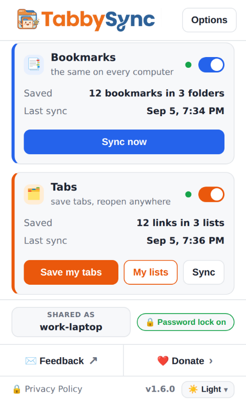
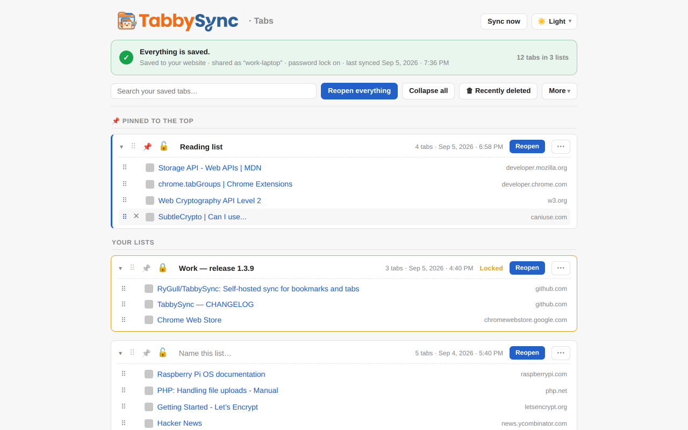
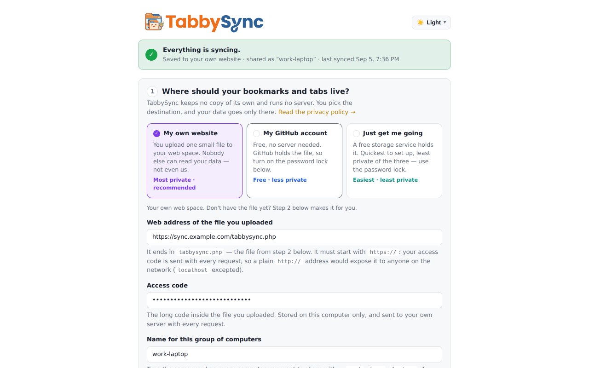
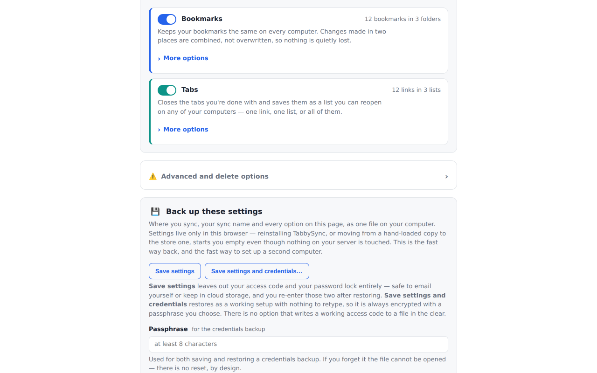
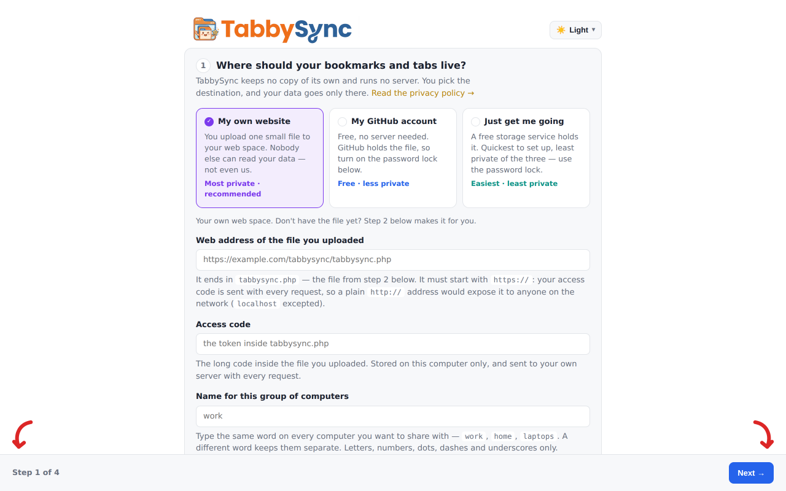

# TabbySync

**Self-hosted sync for your bookmarks _and_ your open tabs — two tools in one
extension, on every browser you use.** TabbySync began as two separate
extensions that were later merged into a single Manifest V3 extension —
running on **Chromium browsers and on Firefox from one codebase** — that talks
to **one sync destination, one token and one sync name**. A companion
**Windows desktop app** manages every sync profile from outside the browser.
Turn on the bookmark sync, the tab sync, or both. Self-hosting your own
endpoint is the recommended setup — free, no-server alternatives (GitHub Gist,
JSONBin.io) are also available for anyone who doesn't have a server, see
[below](#no-server-free-alternatives).

- 📑 **Bookmarks** — syncs your whole bookmark tree (bar + other bookmarks) with
  a true three-way merge, so adds/edits/moves/deletes from several devices are
  merged, not overwritten.
- 🗂️ **Tabs** — collapses open tabs into a saved list to free memory, then
  restores them individually or all at once.

Both engines share **one endpoint and one bearer token**. Files never collide
because each engine namespaces its own file on the server:

```
<server>?name=bookmarks-<syncName>.json     # your bookmarks
<server>?name=tabs-<syncName>.json          # your tab lists
```

Same **sync name** on another computer → that computer shares the same data.
Different names stay separate. Nothing ever leaves your own server.

### Get it

| | | |
|---|---|---|
| **[Add to Chrome](https://chromewebstore.google.com/detail/tabbysync/lfbdjnceepjfamkjclkeahnjhebedfdk)** | Chrome, Edge, Brave, Vivaldi, Opera | Chrome Web Store |
| **[Add to Firefox](https://addons.mozilla.org/addon/tabbysync/)** | Firefox 140+ | addons.mozilla.org |
| **[Download for Windows](https://github.com/RyGull/TabbySync/releases)** | Windows 10/11, 64-bit | newest `control-panel-v*` release |

[tabbysync.com](https://tabbysync.com) · [Privacy policy](https://rygull.github.io/TabbySync/privacy.html)

## Screenshots

Real captures of the shipping UI, regenerated from this working tree by
`node scripts/screenshots.mjs` — see [regenerating them](#screenshots-regenerating-them)
below for how that works. Light mode shown; the dark files sit beside each one in
`docs/screenshots/web/`.

| The popup | The tab list |
| --- | --- |
|  |  |

| Options — server &amp; sync | Options — the two engines |
| --- | --- |
|  |  |

Guided setup — the same options page, one step at a time, opened by the
popup's **Walk me through it** button on a fresh install:



## Install

One click from whichever store your browser uses, and it auto-updates:

* **[Chrome Web Store](https://chromewebstore.google.com/detail/tabbysync/lfbdjnceepjfamkjclkeahnjhebedfdk)** — Chrome, Edge, Brave, Vivaldi, Opera, and any
  other Chromium browser.
* **[Firefox Add-ons](https://addons.mozilla.org/addon/tabbysync/)** — Firefox 140 or newer. (140 is where the
  built-in data-collection consent screen landed; see
  [Firefox](#firefox) for why that is the floor.)

Then click the TabbySync icon. On a fresh install the popup offers two ways
in: **Walk me through it**, a guided setup that asks the same four Options
questions one at a time with Back/Next, or **Set up manually** to open
**Options** and fill it in yourself. Either way you end up choosing the same
thing — enable Bookmarks, Tabs, or both, and a destination.

The same extension, the same file format, the same server: a bookmark saved
from Firefox and one saved from Chrome land in the same file under the same
sync name.

### Or load it unpacked

Running from source instead (to audit it, or to track `main`):

**Chromium:**

1. Open `chrome://extensions`, turn on **Developer mode**.
2. **Load unpacked** → select this repo's folder (the one containing `manifest.json`).
3. Click the TabbySync icon → **Options**.

**Firefox** needs its own manifest built first, because the one at the repo
root declares a service worker Firefox will not run — see
[Loading it in Firefox](#loading-it-in-firefox).

An unpacked copy never auto-updates — you pull the repo yourself when a new
version lands.

## Set up your server (once)

You host a tiny endpoint yourself — a single PHP file with a token you choose.

1. TabbySync → **Settings** → step 1, choose **My own website** → step 2,
   **Don't have that file yet?**
2. Click **Make my file →** — you get `tabbysync-server.zip`
   containing a `tabbysync/` folder (one `tabbysync.php` + two `.htaccess`
   guards) with a fresh random token already baked in.
3. Upload that whole folder to any PHP web host over HTTPS, e.g.
   `https://YOURDOMAIN/tabbysync/tabbysync.php`. HTTPS is **required** —
   TabbySync will not save a plain `http://` server URL, because the bearer
   token is sent with every request and would otherwise cross the network in
   the clear. (`http://localhost` is the one exception, for local testing.)
4. Back in step 1, set:
   - **Web address of the file you uploaded** — `https://YOURDOMAIN/tabbysync/tabbysync.php`
   - **Access code** — click **Fill in my access code above** so it matches the script
   - **Name for this group of computers** — e.g. `work` (the same word on every
     computer you want to share with)
5. **Save and connect**, then **Check it works**. Repeat the same address, code
   and group name on your other computers.

Prefer your own endpoint? Any server that answers `GET`/`PUT` on
`?name=<file>.json` with `Authorization: Bearer <token>` works; the generated
`tabbysync.php` shows the exact contract (it also honours `ETag` / `If-Match`
for safe concurrent writes). It also answers `DELETE`, which Settings →
**Advanced and delete options** uses — that part is optional, only needed if you
want to use those buttons against your own endpoint.

## No server? Free alternatives

Self-hosting is the recommended way to use TabbySync — your data never
leaves a server you control. If that's not realistic for you, **Server &
sync → Sync method** offers two free, no-server backends instead:

- **GitHub Gist** — TabbySync creates a private ("secret") gist for you and
  stores each engine's file inside it. You just need a GitHub personal access
  token scoped to Gists — create one at
  [github.com/settings/personal-access-tokens/new](https://github.com/settings/personal-access-tokens/new)
  (fine-grained token, scoped to just "Gists: Read and write"), or a classic
  token with the `gist` scope.
- **JSONBin.io** — TabbySync creates a bin per engine for you. This one does
  require a free JSONBin.io account: sign up / log in at
  [jsonbin.io](https://jsonbin.io/login), then open **API Keys** from your
  account menu and create a key (the `X-Master-Key`) to paste into TabbySync.

Both are meaningfully **less private than self-hosting**: your data (or its
ciphertext, if you turn on encryption) sits on a third party's servers under
their access and retention policies, not yours. The Options page shows a
disclaimer for each. **If you use either one, turn on the encryption
passphrase above** so that third party only ever sees unreadable ciphertext.

## The password lock (optional, shared)

Settings → step 3, **Lock it with a password**. One password encrypts **both**
tools with AES-256-GCM in your browser before anything is uploaded, so the
stored files are unreadable even to whoever holds them. It never leaves your
device — type the same one on every computer. **If you forget it, the data
can't be recovered.**

## Backing up your settings

Settings — the destination, the access code, the sync name, every option — live
only in `chrome.storage.local`, which is per-install. That survives a store
update, but **not the extension's identity changing**: a browser treats an
unpacked or temporarily-loaded copy and the store copy as two different
extensions with separate storage, so swapping one for the other reads as a
fresh install and every credential has to be retyped. Nothing is ever lost from
the sync destination when that happens — a first sync with no merge base
unions rather than deletes (`bookmarks/lib/engine.js`) — but retyping a bearer
token is not a recovery plan.

**Settings → Back up these settings** writes them to a file, in one of two
shapes. The rule is `shared/settings-backup.js`'s, and it is the same rule the
Control Panel enforces for the same secrets:

| | Contains | Encrypted |
|---|---|---|
| **Save settings** | Everything except the access code and password lock | No — there is nothing sensitive in it |
| **Save settings and credentials** | Everything | **Always**, with a passphrase you choose (min 8 chars) |

There is deliberately no third option: a plaintext file holding a live bearer
token is not a backup. Saved tab lists are *not* included — they have their own
backup on the saved-tabs page, they are already synced, and restoring a stale
copy over a live sync can resurrect lists deleted on another machine.

A restore is a partial write: anything the file does not mention is left alone,
so restoring a credential-free backup onto a working install never blanks the
token that install already has.

## Deleting your synced data

Settings → **Advanced and delete options**, at the bottom of the page. Type `DELETE` to
unlock the buttons (a plain click does nothing on its own), then confirm —
each one still asks you to confirm again before it does anything. Per-provider
buttons remove that provider's remote file(s)/gist/bins and clear its saved
credentials here; the reset button additionally attempts this for every
provider you've ever configured and then wipes every TabbySync setting in this
browser back to a fresh install. None of this touches your actual bookmarks or
open tabs in this browser, or uninstalls the extension — only the remote data
and TabbySync's own local settings.

## Everyday use

- **Toolbar popup** — where both tools are syncing, per-tool on/off switches,
  **Sync now**, **Save my tabs**, **My lists**.
- **Saving tabs** — the popup's **Save my tabs**, `Alt`+`Shift`+`O`, or
  right-click the toolbar icon (this tab / others / left / right).
- **The saved-tabs page** — name, pin, lock, search and reorder your lists;
  **Reopen** one or **Reopen everything**. Fold a list up with its ▾, or use
  **Collapse all**, and the page opens the way you left it. Above 15 tabs it
  asks first and opens them in batches you can stop. Deleted lists wait 30 days
  in **Recently deleted**, on the toolbar.
- **Bookmarks** — just use your browser's bookmarks; changes sync automatically
  (debounced), on a timer, and on window focus.

## Desktop Control Panel (Windows)

Have more than one sync profile (work, personal, a home server) and want to
add/remove/move/copy bookmarks and saved tabs between them without a
browser? **[TabbySync Control Panel](control-panel/)** is a companion
Windows desktop app for exactly that — same self-hosted/Gist/JSONBin
destinations, same merge and encryption, but built to hold several profiles
side by side instead of the extension's one-at-a-time. It can also sit
behind a PIN (asked at every start and after an idle period you set), and
export every profile and setting to a single file — with credentials left
out, or included and always encrypted with a passphrase. See
[`control-panel/README.md`](control-panel/README.md) for what it does, how
it stays wire-compatible with the extension, and how to build or install it.

### Test builds

The app can update itself to a build that is not a public release, so a fix
can be tried before it goes out to everyone. In the app: **Options → Updates →
Which builds to accept → Also test builds**.

Those are ordinary GitHub Releases marked **pre-release**, which is the one
mechanism electron-updater supports for this (`allowPrerelease`, GitHub
provider only). Cut one by giving the version a semver prerelease part —
`control-panel/package.json` at `1.7.1-beta.1`, tagged
`control-panel-v1.7.1-beta.1`. The workflow marks any version containing a
`-` as a pre-release, so GitHub keeps it out of "Latest", the website's
download button never points at it, and only installs that opted in will take
it.

**Not** workflow artifacts, which is the obvious idea and does not work:
downloading one needs an authenticated GitHub token even on a public
repository, they arrive as a zip rather than the `latest.yml` + installer the
updater reads, and they expire. A token shipped inside a desktop app is a
published token.

Coming off the beta channel does not roll anything back — an install sitting
on `1.7.1-beta.1` stays there until the stable line passes it.

**[Download the installer](https://github.com/RyGull/TabbySync/releases)** — pick the newest
`control-panel-v*` release (Windows 10/11, 64-bit). Not `/releases/latest`:
the extension (`v*`) and the app (`control-panel-v*`) both cut releases in
this repository, so "latest" is whichever came last overall and is usually the
extension's, which carries no `.exe`. Each app release also has a portable
`.exe` for anyone who would rather not install. Once installed it updates
itself. Entirely optional: the extension works fully on its own without it.

## How it's built

The extension lives at the repo root:

| Path | What it is |
|------|-----------|
| `manifest.json` | Single MV3 manifest for both tools |
| `background.js` | Module service worker that loads both engines |
| `popup.html` / `popup.js` | The hub UI (two feature cards) |
| `options.html` / `options.js` / `options.css` | Unified options (shared server + per-tool settings) |
| `shared/config.js` | Single source of truth for the shared config keys |
| `shared/providers.js` | Pluggable sync backends: self-hosted, GitHub Gist, JSONBin.io |
| `shared/status.js` | One combined toolbar badge |
| `shared/server-files.js` | Generates the `tabbysync.php` bundle |
| `bookmarks/` | Bookmark engine (`background-core.js` + `lib/`) |
| `tabs/` | Tab engine (`background-core.js`, `storage.js`, `tablist.*`) |

The two original extensions were kept as self-contained engines under
`bookmarks/` and `tabs/`; the shared layer gives them one config, one endpoint,
one token and one toolbar action.

## Icons & logo

The brand mark is a lock + sync-arrows glyph. The popup shows the full
wordmark logo in its top-left, swapped by the light/dark toggle (which remembers
your choice per device, else follows the system):

- `icons/logo-light.png` — wordmark for **light** backgrounds (dark text)
- `icons/logo-dark.png` — wordmark for **dark** backgrounds (light text)

The toolbar/extension icons (`icons/icon-16.png` … `icon-256.png`) are just the mark on
a transparent background, so they sit cleanly on any toolbar. They were
rasterized from the mark; if you change the logo, regenerate the PNGs at those
four sizes (Chrome requires PNG for toolbar icons — it doesn't accept SVG).

## Screenshots (regenerating them)

`scripts/screenshots.mjs` loads this working tree as an unpacked extension in a
throwaway Chromium profile, seeds a demo profile into `chrome.storage.local`,
and photographs the real popup, tab list, options and guided-setup-wizard
pages in both light and dark mode. Nothing is mocked up, so a UI change is one
command away from being reflected everywhere the screenshots appear:

```
npm install          # playwright is the only dev dependency
npm run screenshots
```

It writes three sets under `docs/screenshots/`:

| Set | What it's for |
|-----|---------------|
| `raw/` | 2x captures straight out of the browser (git-ignored — regenerate them) |
| `web/` | downscaled PNGs used by this README and the marketing site |
| `store/` | 1280x800 framed images for the Chrome Web Store listing |

The Chrome Web Store accepts screenshots at exactly 1280x800 or 640x400 with no
alpha channel, which is what the `store/` set is; the site copies live in
`website/assets/img/screenshots/`, so copy `web/` across after regenerating.

The demo profile points at `https://sync.example.com/tabbysync.php`, which
doesn't answer — the script waits for that first doomed sync and then stamps a
settled "synced" status, so the pictures show an ordinary healthy profile rather
than the artifact of there being no server on the machine that took them.

## Firefox

**Published on AMO: [addons.mozilla.org/addon/tabbysync](https://addons.mozilla.org/addon/tabbysync/).** The rest of
this section is how the port works and how to run it from source.

The same source builds both browsers. There is no second copy of the code and
no `firefox/` folder — only the manifest differs, and it is derived from
`manifest.json` at package time by `scripts/make-manifest.mjs`:

| | Chrome | Firefox |
|---|---|---|
| Background | `service_worker` | `scripts` (event page) — Firefox has no MV3 service worker |
| `tabGroups` | requested | dropped; Firefox has no such API |
| Add-on id | n/a | `browser_specific_settings.gecko` |

`shared/browser-compat.js` loads before anything else on every page and in the
worker. On Chrome it does nothing. On Firefox it points `chrome` at the
promise-based `browser`, so the promise-style calls the codebase is written in
work in both. **Everything in the extension must therefore stay promise-style**
— a completion callback silently does nothing on Firefox, and
`test/firefox-build.test.js` fails if one appears.

"Reopen as a browser tab group" is the one feature Firefox does not get. The
code already checks for the API and falls back to ordinary tabs, so nothing
breaks; the option simply has no effect there.

### Loading it in Firefox

Firefox has no persistent "load unpacked" — it has a temporary one, and it
wants a `manifest.json` on disk. The one at the repository root is Chrome's, so
build the Firefox tree first:

```
npm run dev:firefox            # -> dist/firefox/
```

Then `about:debugging` → **This Firefox** → **Load Temporary Add-on…** → pick
`dist/firefox/manifest.json`. It stays until Firefox restarts; re-run the
command and press **Reload** there after changing anything.

Release Firefox will not permanently install an unsigned add-on. Developer
Edition, Nightly or ESR can, with `xpinstall.signatures.required` set to
`false` in `about:config`.

Mozilla's own tools are worth having for this: `npx web-ext run --source-dir
dist/firefox` launches a clean Firefox with it loaded and reloads on change,
and `npm run lint:firefox` builds the zip and runs `addons-linter` over it —
the same validation AMO runs at upload, which is cheaper to fail here than
there. The release workflow runs it too.

**On AMO, an add-on must declare what data leaves the browser.** TabbySync
declares `bookmarksInfo` and `browsingActivity` as required
(`DATA_COLLECTION` in `scripts/make-manifest.mjs`) — Mozilla defines data
transmission as anything handled outside the local browser, which is what
syncing is, so `"none"` would be false. Firefox renders that as "share … with
extension developer", which is Mozilla's wording and wrong here; `privacy.html`
explains it. Declaring it also raises `strict_min_version` to 140, the first
Firefox with the built-in consent screen.

**Run on Firefox as of 1.3.14.** The port loads, the pages render and both
engines sync. Two things only showed up there and are fixed in 1.3.14: Firefox
lists its bookmark roots in a different order (`pickRoots` in
`bookmarks/lib/tree.js`), and it refuses a `permissions.request()` made after
an `await` (`requestAccess` in `options.js`). Firefox's **Bookmarks Menu** is
not synced — the model has two roots, and folding a third into "Other
bookmarks" would move bookmarks nobody asked to move.

## Releasing

```
bash scripts/package.sh          # dist/tabbysync-<version>.zip          — Chrome
bash scripts/package.sh firefox  # dist/tabbysync-<version>-firefox.zip  — Firefox
npm run screenshots            # store images + promo tiles, from the real UI
```

Or let CI do it: push a tag matching the manifest version and
`.github/workflows/release.yml` runs the tests, builds both zips, checks each
manifest is the right shape for its store, and attaches them to a draft GitHub
Release.

```
git tag v1.3.16 && git push origin v1.3.16
```

The tag has to match `manifest.json` or the job stops — a release named after a
version it does not contain is worse than no release. `dist/` is deliberately
git-ignored: build output committed to a repository is stale by the next commit.


`store/listing.md` holds every text field the dashboard asks for, ready to
paste: the description, the single-purpose statement, a justification for each
permission, the remote-code answer and the data-usage disclosures with the
reasoning behind each tick. It is kept beside the code on purpose — a
permission justification is a claim about the manifest, and the two drift apart
the moment they live in different places.

Assets come out of `docs/screenshots/`: `store/` for the 1280x800 listing
images (RGB, no alpha, which the store requires), `promo/` for the 440x280 and
1400x560 tiles.

## Marketing site

`website/` is a separate, fancy, responsive PHP landing page for
tabbysync.com — not part of the extension bundle, not loaded by it, and not
loading it. See [website/README.md](website/README.md) for what it is and
how to deploy it; `.htaccess` there forces HTTPS and pins the host name, so
read its header before a first deploy.

Its SEO and security posture is checked by `test/website.test.js` rather than
left to drift: canonical links and the sitemap have to agree on one origin,
the 404 page has to answer 404, the structured data may not claim a rating
nobody can verify, and the strict Content-Security-Policy stays enforceable
because the test fails the moment an inline `<script>`, `<style>` or
`style=""` attribute appears anywhere in the site.

The site's contact form uses reCAPTCHA v3, which is the one third-party
request anywhere in this project — the extension itself still contacts nobody
but the sync destination you configure. **Its keys live in
`website/config.local.php`, which is git-ignored and must stay that way**; a
test fails if a key-shaped string ever appears in a tracked file. See
[website/README.md](website/README.md#recaptcha--where-the-keys-go) for the
setup, and note that the site works with no keys configured at all.

## Changelog

Notable changes are recorded in [CHANGELOG.md](CHANGELOG.md).

## Versioning

The extension version lives in `manifest.json`. A git hook auto-increments the
**patch** number on every commit, so it never sits stale. Enable it once per
clone:

```
sh scripts/setup-hooks.sh          # or: git config core.hooksPath .githooks
```

- The hook bumps `x.y.Z` (e.g. `1.0.3` → `1.0.4`) and re-stages `manifest.json`.
- **Manual bumps win:** if a commit already changes the version (e.g. you set
  `1.1.0` for a feature or `2.0.0` for a breaking change), the hook leaves it be.
- Skip a bump for one commit with `git commit --no-verify` (or
  `SKIP_VERSION_BUMP=1 git commit …`).

Reloading the unpacked extension on `chrome://extensions` is what makes the
new version show up in the browser.

## License

**TabbySync is source-available, not open source.**

Copyright © 2026 Ryan Gulliver. All rights reserved. See [LICENSE](LICENSE) for
the full terms.

The source is published so anyone can audit it — TabbySync handles your
bookmarks, your open tabs and your sync credentials, and you shouldn't have to
take my word for what it does with them. That's the point of publishing it. It
is not a grant to redistribute it.

**You may**, free of charge, for your own personal use:

- install and run the extension on as many of your own devices as you like
- run the generated `tabbysync.php` on your own server
- modify your own copy for yourself

**Anyone may read, study and audit the source**, for any purpose. That right
isn't limited — it's why the code is public.

**You may not** use it for any commercial purpose (including inside a company or
as part of your job), redistribute it (modified or not), publish it to the
Chrome Web Store or any other add-on marketplace, sell it, or offer it as a
hosted service.

Want to use it commercially? Ask — separate terms can be arranged.

TabbySync is free and always will be. If it's useful to you, a donation is
appreciated but never required — it buys no extra rights, and nothing in the
extension is gated behind one.

### Contributions

**Not accepted.** Pull requests will be closed without merging. Bug reports and
feature suggestions are very welcome — see [CONTRIBUTING.md](CONTRIBUTING.md)
for why, and for what to include in a report.

### Trademarks

TabbySync is not affiliated with, endorsed by, or sponsored by any of the
browsers it runs on or the services it can sync to. Chrome and Chromium are
trademarks of Google LLC; Firefox and Mozilla are trademarks of the Mozilla
Foundation; Windows and Microsoft Edge are trademarks of Microsoft Corporation;
GitHub and Gist are trademarks of GitHub, Inc.; PayPal is a trademark of PayPal,
Inc.; JSONBin.io is the property of its owner. They are named here only to
describe what TabbySync runs on and interoperates with.

### Disclaimer

TabbySync synchronises, encrypts and deletes your own data. It is provided as
is, with no warranty of any kind, and the author accepts no liability for lost
or damaged bookmarks or tabs. **Keep your own backups, and keep your own
password lock — a forgotten password cannot be recovered.** See
[LICENSE](LICENSE) sections 7 and 8.

## Tests

The code that decides whether your data survives a sync is covered by tests.
They need no dependencies and no browser:

```
npm test          # or: node --test test/*.test.js
```

`test/merge.test.js` covers the properties that matter most, first among them
the ones that guard against data loss:

- a first sync (no common base) **unions** both sides and can never delete
- a lost or corrupted base snapshot degrades to a union — duplicates at worst
- an edited bookmark survives its folder being deleted on another device
- move cycles are broken by reattaching, never by discarding
- a type conflict keeps the folder, so its subtree isn't dropped
- 200 generated tree shapes, asserting no URL is ever lost

plus deletion semantics (`deleteWins` on and off), duplicate suppression via
URL/folder-title matching, last-writer-wins conflicts, folder ordering by
`orderRev`, and convergence — merging is stable, doesn't mutate its inputs, and
reaches the same data whichever machine is "local".

`test/tree.test.js` covers the pure tree helpers underneath (`normUrl`,
`semanticKey`, `flatten`, `sameFields`, `stats`).

`test/crypto.test.js` holds the encryption promise to account: round trips,
a wrong passphrase failing loudly, tampered ciphertext/salt/IV being rejected
rather than decrypted, a fresh salt and IV per write, and — the claim the
privacy policy makes — that the stored envelope leaks none of the plaintext.

`test/import-merge.test.js` covers importing against a fake `chrome.bookmarks`:
imports only ever add, never remove; duplicates are suppressed by normalised
URL (including within the imported file itself); same-named folders are reused
and merged all the way down; other browsers' root names (`Bookmarks Toolbar`,
`Favorites Bar`, `Other Favorites`, …) route to the right root; and re-importing
a file you just exported adds nothing.

`test/providers.test.js` covers the sync backends against a scripted `fetch`:
request shape and bearer auth, a missing file reading as "nothing stored yet"
rather than an error, `ETag`/`If-Match` conditional writes, `412` being flagged
as a **conflict** so a concurrent write from another device is re-merged
instead of clobbered, a truncated GitHub Gist being re-fetched in full, and
auth failures surfacing rather than looking like empty data.

Every suite has been mutation-tested: deliberate bugs were seeded into the
source (delete-wins flipped, first sync deleting, conflict detection dropped,
import de-duplication removed, the encryption salt fixed, the AES-GCM
authentication failure swallowed, and others) and each one was caught by a
failing test before being reverted.

CI runs the suite on every push (`.github/workflows/test.yml`), along with a
`php -l` check on the generated `tabbysync.php`.

`package.json` exists only for this test harness. The extension itself never
reads it and still has zero dependencies.
