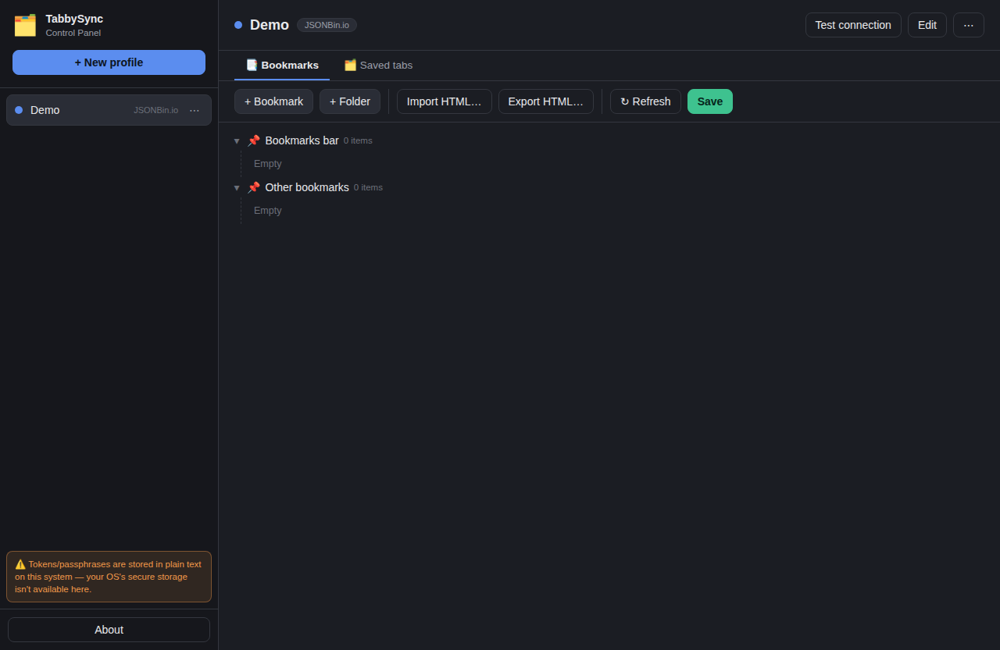
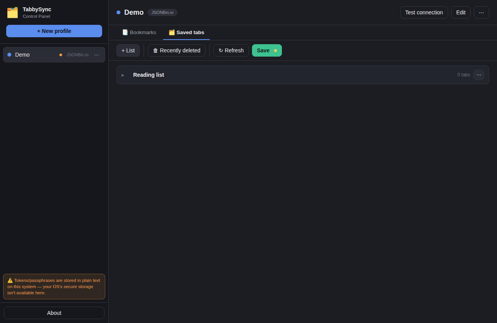

# TabbySync Control Panel

A Windows desktop app for managing **every TabbySync sync profile, bookmark
and saved-tabs list from one place** — add, remove, move and copy any of
them, including between different profiles, without opening a browser.

It talks to the exact same destinations your TabbySync browser extension
does (a self-hosted server, a GitHub Gist, or JSONBin.io), using the same
file format, the same three-way bookmark merge, and the same AES-256-GCM
encryption — so anything you do here is safe to sync against a device
running the extension, and vice versa. See
[How it stays compatible](#how-it-stays-compatible-with-the-extension) below
for how that's enforced, not just claimed.

| Bookmarks | Saved tabs |
|---|---|
|  |  |

## Why this exists

The extension holds **one** active sync connection per browser install. This
app's whole reason to exist is holding **several** side by side — "Work",
"Personal", "Home server", whatever you've got — each with its own server/
Gist/JSONBin destination, and letting you drag/copy/move bookmarks and saved
tabs between them, which the extension has no way to do (it only ever talks
to one destination at a time).

## Features

- **Profiles** — add, edit, duplicate, reorder and remove sync profiles.
  Each is a fully independent connection (self-hosted / GitHub Gist /
  JSONBin, its own token, sync name and optional encryption passphrase) —
  the same picker and field labels as the extension's own Options page.
  Reorder by dragging a profile onto another (drop on its top or bottom
  half to land above or below it) — its ⋯ menu's "Move up"/"Move down"
  still work too, for anyone who hasn't noticed dragging works. **Test
  connection** lives in Edit (a footer button, with the result shown right
  there) and tests exactly what's currently typed — including an edit
  that hasn't been saved yet — not just whatever was last saved.
- **Bookmarks** — loads a profile's whole bookmark tree, lets you add,
  rename, edit, delete, reorder, move and copy bookmarks and folders
  (drag-and-drop or the right-click menu), **including copying or moving
  a bookmark or folder straight into a different profile**. Import/export
  the Netscape bookmarks HTML format any browser uses. Double-clicking a
  bookmark opens it in your default browser (editing moved to the
  right-click menu); hovering a row surfaces a red ↗ open button and a
  blue ✎ edit button so the two most common actions don't hide among a
  row of identical grey icons.
- **Saved tabs** — add, rename, pin, lock, duplicate, reorder and delete
  lists; add, edit, remove, move and copy individual tabs — again
  including across profiles. Double-click a tab (or its ↗ button) to open
  it in your default browser; a list's own ↗ button or its right-click
  menu opens **every** tab in it the same way. Opening more than 15 at
  once asks first and offers "open the first 25" as an alternative to
  "open all", then opens them a handful at a time with a Stop button —
  the same ceiling protection as the browser extension's own restore-all,
  because nothing stops "restore this 400-tab list" from being one click
  otherwise. The one thing it can't do that the extension can:
  **group the opened tabs into a browser tab group** —
  `chrome.tabs.group()`/`chrome.tabGroups` are extension-only APIs a
  desktop process has no access to, so tabs open ungrouped. Deleted lists
  go to **Recently deleted** for 30 days, same as the extension. Lists
  reorder the same way profiles do — drag one list's header onto another's
  (top/bottom half decides above or below), or use "Move up"/"Move down"
  in its ⋯ menu, which stays right where it was. That menu's two most-used
  actions (**Open all in browser…**, **Rename…**) carry the same red ↗ /
  blue ✎ icons as their row buttons, so they don't blend into the plain
  Pin/Lock/Duplicate/Delete entries around them.
- **Live connection status** — each profile's sidebar dot and the header
  dot on its detail view reflect what actually happened on the last
  load/save/test for that profile: green once either bookmarks or saved
  tabs has loaded or saved successfully, red once either has failed, grey
  until either has been tried. Not a fixed colour you picked when creating
  the profile — the same "worst engine wins, but either one succeeding
  counts" logic as the extension's own combined status badge
  (`shared/status.js`).
- **Safe by construction, not by luck** — every save re-fetches the
  destination and merges instead of overwriting, so something changed by
  the extension (or another device) between your last load and your save
  is folded in, not clobbered. A save that would delete most of a
  substantial bookmark tree in one go is refused unless you confirm it —
  the same safety brake `bookmarks/lib/engine.js` uses. A self-hosted
  profile's server address must be `https://` (the exception is
  `localhost`/`127.0.0.1`) — same rule and same reason as the extension's
  options page: the access token rides in a header on every request,
  outside whatever the sync passphrase encrypts.
- **Secrets encrypted at rest** where the OS supports it — tokens and
  passphrases go through Electron's `safeStorage` (DPAPI on Windows) before
  touching disk. If that's unavailable, the app says so plainly (sidebar
  banner) rather than silently storing them in plain text.
- **Theme** — 🖥️ System / ☀️ Light / 🌙 Dark, the dropdown at the bottom of
  the sidebar (defaults to System). Drives `nativeTheme.themeSource`, so it
  applies to the whole app, not just a CSS class toggle. Shares its row
  with the installed version number, on the right.
- **One instance only** — launching the app again while it's already
  running (a taskbar-pinned icon is the common way to hit this, especially
  while the window is minimized or hidden in the tray) brings the existing
  window forward instead of starting a second, independent process with no
  coordination between them (`app.requestSingleInstanceLock()`).
- **Options** (File → Options…, or the sidebar button) — start with Windows
  (a real login-item registration, not a hand-rolled registry edit), start
  minimized to the tray, reopen the last profile you had open on startup,
  and what the window's close button (✕) does: ask each time (default),
  always minimize to the tray, or always quit. A tray icon is always
  present regardless of these settings — it's what makes "start minimized"
  and "minimize to tray" recoverable rather than a dead end with no way
  back in. None of this makes the app sync in the background; minimizing
  just keeps the window a click away.
- **Help menu** — links to the TabbySync website, the GitHub repo, and a
  Donate page, plus an in-app **Privacy Policy** (its own document, not
  the extension's — this app stores multiple profiles and has no
  equivalent of a single active provider, so the two policies read
  similarly but aren't the same document).
- **Updates** — the installed app checks this repo's Releases on startup
  (`electron-updater`), downloads a new version in the background if one
  exists, then asks before restarting to install it — declining still
  installs it automatically the next time you fully quit, so nobody has
  to remember to come back. "About" (sidebar) has a **Check for updates**
  button for an on-demand check any time. Only the installer build can
  update itself this way — the portable `.exe` has nothing installed to
  update in place, so it always reports "not available" there; download a
  new copy by hand instead.

## How it stays compatible with the extension

Rather than re-implement the extension's merge/crypto/provider logic (and
risk it quietly drifting), this app **vendors the real files** —
`bookmarks/lib/{tree,merge,crypto,bookmarks-io,sync}.js`,
`shared/providers.js`, `tabs/storage.js` — copied verbatim from the parent
repo by `scripts/vendor.mjs` before every `npm start`/`npm test`/
`npm run dist:win`, into `vendor/` (git-ignored, regenerated every time —
see its own file comment). The only things written from scratch are ones
the extension has no equivalent of at all: multi-profile storage
(`src/core/profile-store.js`) and the tree/list edit operations a UI needs
that a browser's own bookmarks API otherwise provides
(`src/core/bookmarks-ops.js`, `src/core/tabs-ops.js`).

Two small pieces *are* re-typed by hand instead of vendored, specifically to
avoid dragging in unrelated `chrome.bookmarks`-calling code
(`sanitizeSyncName` in `src/core/provider-shim.js`, the deletion safety-brake
constants in `src/core/remote-bookmarks.js`) — `test/vendor-parity.test.js`
diffs both against the real, non-vendored source on every test run so an
upstream change can't silently drift out from under them unnoticed.

## Install

**Download** the installer or portable `.exe` from this repo's
[Releases](../../releases) (built by `.github/workflows/control-panel.yml`
on an actual Windows runner — this app is developed on Linux, so that
workflow is the one place a real Windows build gets produced and verified).
The installer adds a Start Menu / desktop shortcut; the portable build just
runs.

### Run from source

```
cd control-panel
npm install
npm start
```

### Build the Windows installer yourself

```
cd control-panel
npm install
npm run dist:win        # -> dist/*.exe (NSIS installer + portable)
```

Needs to run on (or be cross-compiled for) Windows — `electron-builder`'s
NSIS target relies on Windows-only tooling for the installer's icon/resource
editing. From any platform, `npm run dist:win:dir` produces an unpacked
`dist/win-unpacked/` build without the installer step, useful for a quick
local check. The `.ico` app icon is generated from the extension's own
`icons/icon-*.png` set (`npm run icon`), not a second copy — see
`scripts/make-icon.mjs`.

## How it's built

| Path | What it is |
|---|---|
| `main.cjs` | Electron main process — window, menu, all IPC handlers |
| `preload.cjs` | The only bridge into Node the renderer gets (`contextIsolation` + `sandbox`, both on) |
| `renderer/` | The UI — plain HTML/CSS/JS, no framework, no bundler |
| `src/core/provider-shim.js` | Loads the vendored providers/tabs-storage modules, shims what they expect from the extension's `shared/config.js` |
| `src/core/cfg-map.js` | Maps a Profile record onto the vendored modules' expected `cfg`/`settings` shapes |
| `src/core/profile-store.js` | Multi-profile persistence (`profiles.json` in the OS user-data dir), secrets via `safeStorage` |
| `src/core/bookmarks-ops.js` / `tabs-ops.js` | Pure add/remove/move/copy/reorder operations, the thing a browser's own APIs would otherwise provide |
| `src/core/remote-bookmarks.js` / `remote-tabs.js` | Load/save orchestration: fetch, merge, safety brake, push |
| `src/core/sessions.js` | Per-profile in-memory working copies + the cross-profile copy/move orchestration |
| `electron-updater` (`main.cjs`'s `setupAutoUpdate()`) | Checks this repo's GitHub Releases for a newer version, downloads it, prompts before installing |
| `scripts/vendor.mjs` | Copies the extension modules this app depends on into `vendor/` |
| `scripts/make-icon.mjs` | Builds `build/icon.ico` from the extension's own PNG icon set |

## Security notes

- Renderer runs with `contextIsolation: true`, `nodeIntegration: false`,
  `sandbox: true`; the only surface it gets is the typed API in
  `preload.cjs`. A strict `Content-Security-Policy` in `renderer/index.html`
  blocks the renderer from making network requests of its own
  (`connect-src 'none'`) — every request this app makes goes through the
  main process, to the destination you configured, same as the extension.
- Bookmark/tab titles and URLs are rendered via `textContent`/DOM APIs
  everywhere, never `innerHTML` — the one narrow exception is the
  provider-picker's setup instructions, which are small hard-coded HTML
  strings from `shared/providers.js` itself (not user data); see
  `trustedHintNode()`'s comment in `renderer/app.js`.
- Favicons are **not** fetched or rendered — an `` pointed at a remote
  URL is a tracking pixel by another name (the same reasoning email/RSS
  clients block remote images by default), and nothing here needs them.
- New browser windows/navigation from inside the app are denied and handed
  to your system's default browser instead (`shell.openExternal`), including
  the provider setup-instruction links and "open in browser" on tabs.

## Known limitations

- **Bookmark deletions are not recoverable from within this app.** Saved
  tabs get a 30-day "Recently deleted" (same as the extension); bookmarks
  don't have an equivalent undo here — the merge algorithm tracks bookmark
  deletion by a node's absence, not a tombstone, so there's nowhere to
  restore one from once a save has gone through. Deleting a folder asks for
  confirmation and says how many items are inside it precisely because of
  this.
- Drag-and-drop reorders within a list/folder and moves between them; it
  does not currently support dropping onto a profile in the sidebar — use
  the right-click "Move/Copy to another profile…" menu for that instead.
- No auto-sync/background polling — this is an edit-and-save tool, not a
  second background syncer. Saves are explicit (button or Ctrl+S) so a
  self-hosted server or a free provider's rate limit is never hit by
  accident.
- The tray icon is a Windows-only guarantee. Electron's Linux tray
  implementation generally can't load a `.ico` (it wants PNG, and needs a
  desktop environment's tray/StatusNotifierItem support besides — a bare
  Xvfb session, which is what this app is developed and smoke-tested
  against, has neither), so `createTray()` fails there — caught, logged,
  and otherwise harmless, but "start minimized"/"minimize to tray" have
  only ever been exercised for real on Windows.
- Builds aren't code-signed (no certificate for a personal, non-commercial
  project). Windows SmartScreen may still flag a freshly downloaded
  installer the same way it already does today — auto-update doesn't
  change that, since it's the same unsigned installer either way, just
  fetched automatically instead of by hand. The update feed itself
  (`dist/latest.yml`, generated and verified by electron-builder/
  electron-updater) isn't affected by this — it's a separate mechanism
  from OS code-signing trust.

## Testing

```
cd control-panel
npm test          # node's own test runner — no Electron, no display needed
```

Covers the new logic (`profile-store`, `bookmarks-ops`, `tabs-ops`,
`sessions`' cross-profile orchestration) against a scripted `fetch`, the
same technique the extension's own `test/providers.test.js` uses, plus the
vendor-parity checks described above. `test/sessions.test.js` is the one
that matters most: it runs a small in-memory fake self-hosted server keyed
by URL and proves a cross-profile **move** actually removes from the source
only after the target save has genuinely succeeded, and that a failed
removal is reported as `MOVE_PARTIAL` rather than silently duplicating data.

There's also a screenshot-based smoke test of the real Electron UI
(`TABBYSYNC_SMOKE_TEST=<dir> electron .`, headless via `xvfb-run` on Linux)
that drives a few basic interactions and saves what actually rendered —
see `runSmokeTest()` in `main.cjs`. It's how the `[hidden]`/CSS-specificity
bug that was in an earlier version of `renderer/styles.css` got caught:
`node --test` has no idea what a browser paints, so nothing here claims the
UI works without having actually watched it render.

## License

Same terms as the rest of this repository — see [../LICENSE](../LICENSE).
Personal, non-commercial use; source published so it can be audited, not so
it can be redistributed.
